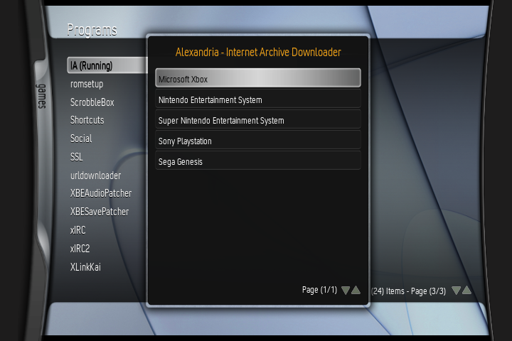
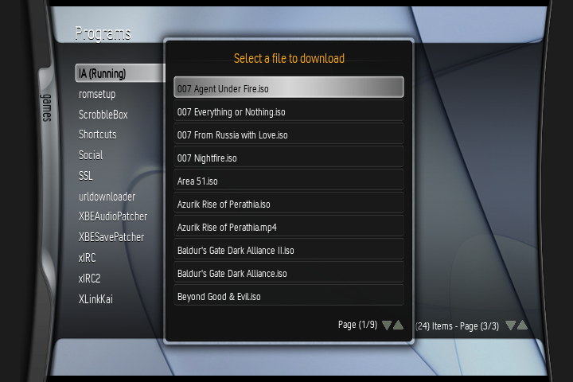
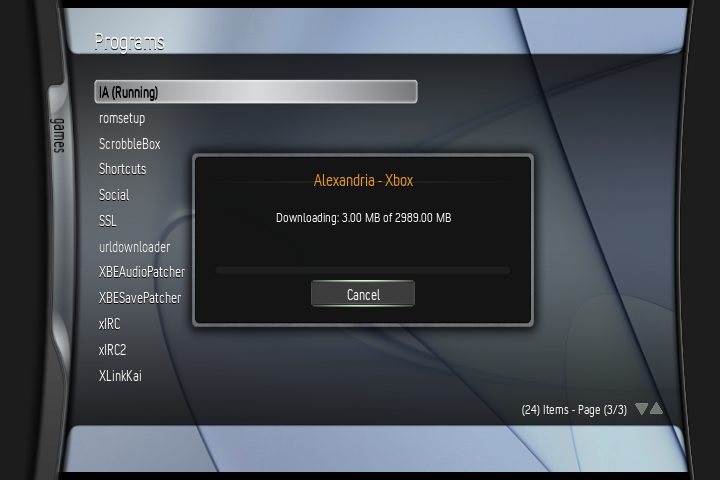

# Alexandria
Internet Archive downloader for XBMC. 

Requires the latest version of XBMC from Xbins (as it has crucial TLS/SSL updates that allow this script to work). Sources are NOT provided and must be input manually!

## How To Use:
- Download latest release file, or "release" folder from the repository.
- Extract the .zip file, edit "default.py" to point "COLLECTION_URL" to the Internet Archive collection of your choice 
- Copy the "Alexandria" folder to Q:/scripts
- Run the script and enjoy!
- (Optional) To make a launcher front-end for multiple sources, modify "launcher.py" with the names of sources that you'd like to add, modify "source1.py / source2.py / source3.py" to point at your Python script of choice (add or remove as many entries as needed), then rename "launcher.py" to "default.py"!

## Issues:
- The script blocks files over 4GB (downloading + individual files stored in .zip files) due to FATX limitations. I could possibly modify the script to download & extract files over 4GB in parts, but the performance penalties may not be worth it compared to using a PC.
- The script can be kind of slow, especially when compared to FTP. Higher chunk values increase the likelihood of XBMC crashing, so they're set to a small but reasonable value. You can modify this value yourself to attempt to increase performance but YMMV, especially on RAM-limited themes on stock 64MB Xbox consoles (use 2048*1024 at absolute max).
- Some files with absurdly long file names and multiple special characters (like "4 Game in One - Ice Hockey, Phantom UFO, Spy Vs. Spy, Cosmic Avenger (1983) (Bit Corporation) (PAL).bin") will crash the script. Sanitization function definitely needs a bit of work.
- File name doesn't display properly on files over 4GB, but the error still works!
- You tell me.

## TODO:
- Add option to mount & launch .ISO files, ROM files and media files directly after downloading.
- Improve media streaming a bit.
- Implement better filename sanitization
- Implement scanning from multiple collections at the same time.
- Implement some sort of login system so access-locked files can be downloaded.
- Add some sort of toggle to allow the user to select their download directory manually or to the script defaults.

## Disclaimer:
- The Internet Archive is a vast archive of many files, tons of which are legal to download! Make sure you follow the copyright laws of your region while downloading from Internet Archive sources. Support will not be given for anyone trying to use this utility for blatant piracy. 
